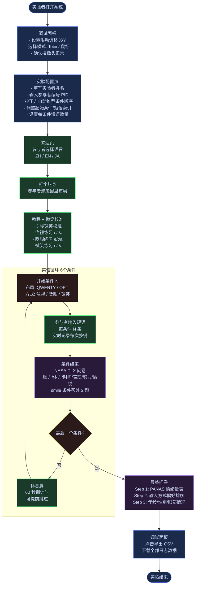

# 实验者旅行图 — 眼动微笑输入实验

## 整体流程概览



---

## 阶段详解

### Phase 1 — 实验准备（实验者）

| 步骤 | 操作 | 关键配置项 | 可能遇到的问题 |
|------|------|-----------|--------------|
| 打开系统 | 运行 `pnpm dev --host` | — | — |
| 启动 bridge | Windows 端运行 `bridge.py` (Tobii 模式) | `--mock` 参数改为鼠标模拟 | Tobii 驱动未安装 |
| 调试面板 | 检查摄像头 / 眼动仪连接状态 | 偏移 X/Y、Tobii/鼠标模式 | 摄像头权限被拒 |
| 实验配置 | 输入参与者编号，点击"拉丁方推荐" | PID 决定条件顺序 | 编号重复会覆盖旧数据 |
| 条件顺序 | 手动上下调整顺序（可选） | 起始条件、起始短语、每条件短语数 | — |

---

### Phase 2 — 参与者入座（参与者）

| 步骤 | 时长估计 | 参与者操作 | 系统记录 |
|------|---------|-----------|---------|
| 语言选择 | < 1 min | 点击 ZH / EN / JA | — |
| 打字热身 | ~2 min | 用当前键盘布局打若干字母 | — |
| 微笑校准 | ~1 min | 自然微笑 3 秒，获取峰值 | `smileCalibPeak`、`smileThreshold` |
| 教程练习 | ~5 min | 依次用 3 种方式各输入 e / t / a | — |

---

### Phase 3 — 正式实验（核心循环）

每个条件 = 1 种键盘布局 × 1 种输入方式，共 **6 个条件**（拉丁方平衡）。

| 条件内阶段 | 内容 | 数据记录 |
|-----------|------|---------|
| 打字任务 | 输入 N 条短语，每条完整句子 | `char_input`: 按键、正确性、注视坐标、微笑分数、眨眼时长 |
| NASA-TLX 问卷 | 6 维度 × 7 点量表（立即填写，记忆最新鲜） | `condition_survey`: tlxMental/Physical/Temporal/Performance/Effort/Happiness |
| 微笑专项题 | 仅 smile 条件：不自然感 + 尴尬感（5点） | `condition_survey`: smileNaturalness / smileEmbarrassment |
| 休息 | 60 秒（可 30 秒后跳过）| — |

---

### Phase 4 — 实验结束（参与者 + 实验者）

| 步骤 | 内容 | 数据记录 |
|------|------|---------|
| PANAS | 20 个情绪形容词，1–5 评分 | `final_survey`: panasAnswers |
| 偏好排序 | 拖拽排列 3 种输入方式 | `final_survey`: preferenceRank |
| 人口统计 | 年龄、性别、眼部疾病 | `final_survey`: age / gender / hasEyeCondition |
| 数据导出 | 实验者点击"导出 CSV" | 包含全部 `char_input`、`condition_survey`、`final_survey` 记录 |

---

## 实验者情绪曲线

```
满意度
  5 │                     ●
  4 │     ●           ●       ●       ●
  3 │ ●       ●   ●       
  2 │
  1 │
    └─────────────────────────────────────────▶ 时间
      系统  实验  参与  教程  实验  问卷  数据
      启动  配置  者入座      循环       导出
```

**低谷**：每个条件中途出现眼动漂移或摄像头中断时，实验者需干预。
**高峰**：数据成功导出，CSV 中确认所有条件的记录完整时。

---

## 关键数据流

```
参与者操作
    │
    ▼
InputController (dwell / blink / smile)
    │  char_input log
    ▼
DataStore (IndexedDB)
    │
    ├── experiment_start  ← 每个条件开始时，含配置快照
    ├── phrase_show       ← 每次新短语出现
    ├── char_input        ← 每次按键（含注视坐标、微笑分数）
    ├── condition_survey  ← NASA-TLX（每条件结束后）
    └── final_survey      ← PANAS + 偏好 + 人口统计
            │
            ▼
        exportCSV()
            │
            ▼
        logs_<timestamp>.csv
```

---

## 时间估算（每位参与者）

| 阶段 | 时长 |
|------|------|
| 实验者准备 + 配置 | 5 min |
| 参与者入座 + 教程 | 8–10 min |
| 正式实验 6 条件（含休息） | 25–35 min |
| 最终问卷 | 5 min |
| **合计** | **~45–50 min** |
